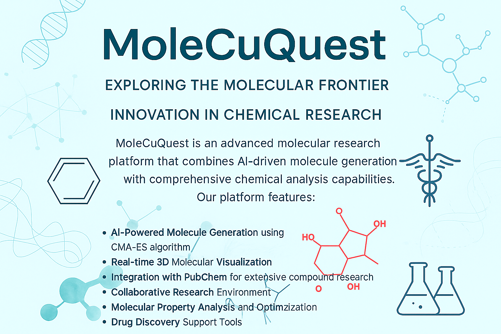
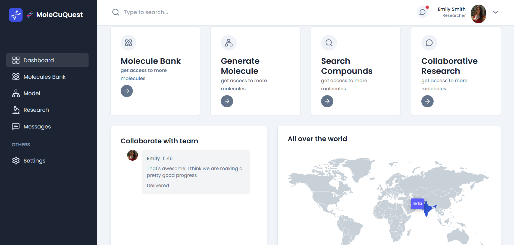
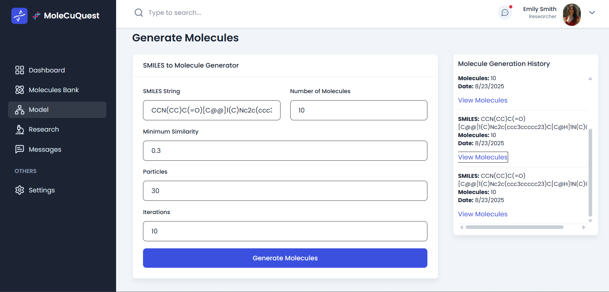
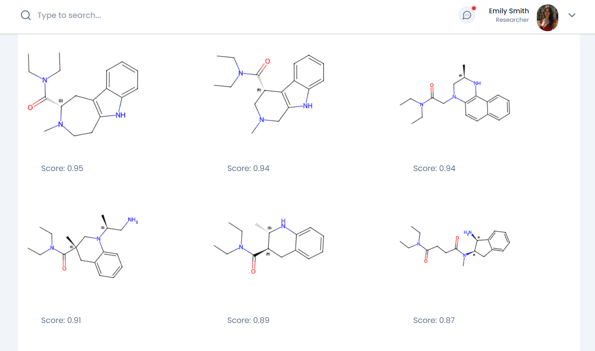
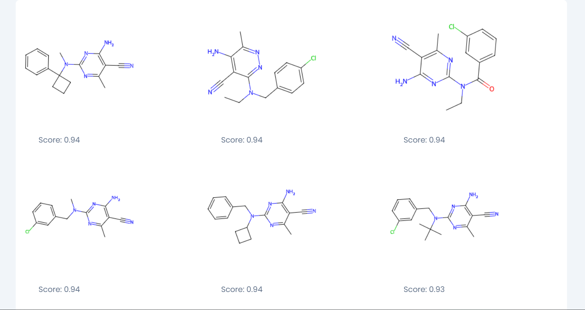
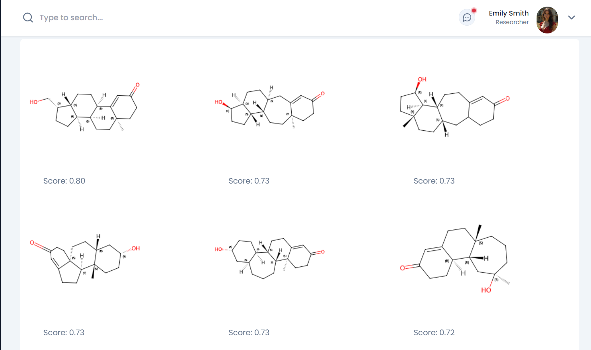
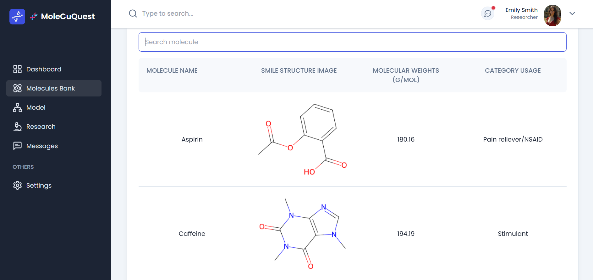
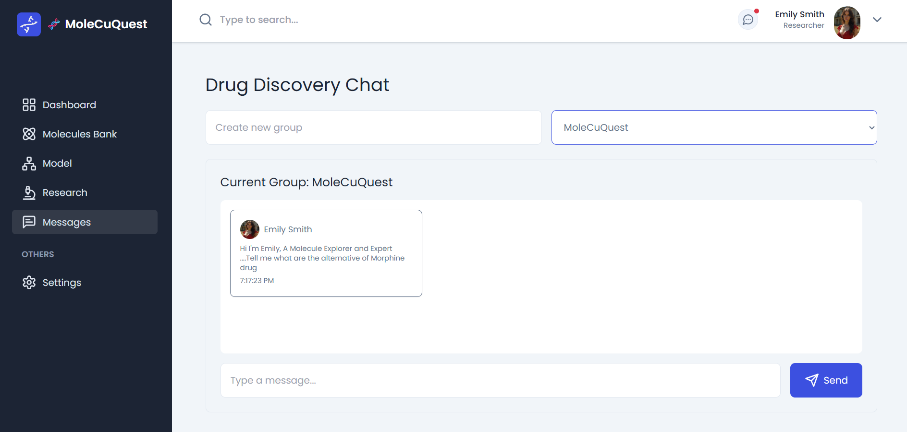

<div align="center">
  
  
  <br />

  <div>
    
    
    
    
    
    
  </div>

  <h1 align="center">MoleCuQuest</h1>
  <h3 align="center">Advanced Molecular Research Platform</h3>

   <div align="center">
     <strong>Exploring the Molecular Frontier - Innovation in Chemical Research</strong>
    </div>
</div>

## Table of Contents

1. [Introduction](#introduction)
2. [Features](#features)
3. [Platform Overview](#platform-overview)
4. [Technology Stack](#technology-stack)
5. [Installation](#installation)
6. [Environment Configuration](#environment-configuration)
7. [Usage Guide](#usage-guide)
8. [API Integration](#api-integration)
9. [Project Structure](#project-structure)
10. [Contributing](#contributing)

## Introduction

**MoleCuQuest** is a cutting-edge molecular research platform that combines AI-driven molecule generation with comprehensive chemical analysis capabilities. Built with modern web technologies and powered by NVIDIA's advanced machine learning models, MoleCuQuest enables researchers to accelerate drug discovery and molecular design processes.

The platform integrates state-of-the-art algorithms for protein structure prediction, molecular docking simulations, and real-time molecular visualization, making it an essential tool for pharmaceutical researchers, chemists, and bioinformatics professionals.

## Features

### Core Capabilities
- **AI-Powered Molecule Generation**: Utilizes NVIDIA MolMIM for generating novel molecular structures with desired properties
- **Real-time 3D Molecular Visualization**: Interactive molecular structure rendering using RDKit
- **Comprehensive Chemical Analysis**: Integration with PubChem for extensive compound research
- **Collaborative Research Environment**: Real-time team collaboration with messaging and project sharing
- **Molecular Property Analysis**: Advanced algorithms for molecular property optimization
- **Drug Discovery Support**: Tools and metrics for pharmaceutical research applications

### Advanced Features
- **CMA-ES Algorithm**: Covariance Matrix Adaptation Evolution Strategy for molecular optimization
- **QED Scoring**: Quantitative Estimate of Drug-likeness for pharmaceutical applications
- **SMILES Integration**: Support for both Canonical and Isomeric SMILES representations
- **User Authentication**: Secure user management with NextAuth.js
- **Responsive Design**: Optimized for desktop, tablet, and mobile devices

## Platform Overview

### Dashboard


The central hub providing access to all platform features with an intuitive interface for navigation and project management.

### Molecule Generator


Advanced molecular generation interface powered by NVIDIA MolMIM, allowing researchers to create novel compounds with specific properties.

### Molecular Visualization
<div style="display: flex; gap: 20px; margin: 20px 0;">
  
  
</div>

Real-time molecular structure visualization with support for complex molecular architectures and ring structures.

### Chemical Representation


Advanced chemical representation supporting wedge-dash notation for stereochemical information.

### Molecule Bank


Comprehensive database of molecular structures with advanced search and filtering capabilities.

### Collaborative Environment


Real-time messaging and collaboration tools for research teams.

## Technology Stack

### Frontend
- **Next.js 14**: React framework with App Router for modern web applications
- **TypeScript**: Type-safe development for enhanced code quality
- **Tailwind CSS**: Utility-first CSS framework for responsive design
- **Lucide React**: Modern icon library for consistent UI elements

### Backend & APIs
- **NVIDIA NIM**: Advanced AI models for molecular generation and analysis
- **MongoDB Atlas**: Cloud-based NoSQL database for scalable data storage
- **NextAuth.js**: Comprehensive authentication solution
- **PubChem API**: Chemical database integration for compound research

### Molecular Science
- **RDKit**: Open-source cheminformatics toolkit for molecular manipulation
- **SMILES**: Simplified molecular-input line-entry system
- **CMA-ES**: Evolutionary algorithm for molecular optimization

### Additional Services
- **Ably**: Real-time messaging and collaboration features
- **Resend**: Email service for user notifications

## Installation

### Prerequisites
Ensure you have the following installed:
- **Node.js** (v18 or higher)
- **npm** or **yarn** package manager
- **Git** for version control

### Clone Repository
```bash
git clone https://github.com/HarshTomar1234/MoleCuQuest.git
cd MoleCuQuest
```

### Install Dependencies
```bash
npm install
# or
yarn install
```

## Environment Configuration

Create a `.env` file in the project root with the following configuration:

```env
# NVIDIA API Configuration
NEXT_PUBLIC_NVIDIA_API_KEY=your-nvidia-api-key

# Database Configuration
MONGODB_URL=your-mongodb-atlas-connection-string

# Authentication
NEXTAUTH_SECRET=your-secure-random-string
NEXTAUTH_URL=http://localhost:3000

# Application Settings
NEXT_PUBLIC_API_BASE_URL=http://localhost:3000

# Optional Services
ABLY_API_KEY=your-ably-api-key
RESEND_KEY=your-resend-api-key
```

### API Key Setup

#### NVIDIA API Key
1. Visit [NVIDIA Build Platform](https://build.nvidia.com/nvidia/molmim-generate/deploy)
2. Create a free developer account
3. Generate your API key for MolMIM access

#### MongoDB Atlas
1. Create account at [MongoDB Atlas](https://cloud.mongodb.com/)
2. Set up a free cluster
3. Configure database access and network settings
4. Obtain connection string

## Usage Guide

### Starting the Development Server
```bash
npm run dev
```
Access the application at `http://localhost:3000`

### Building for Production
```bash
npm run build
npm start
```

### Key Features Usage

#### Molecule Generation
1. Navigate to the "Generate Molecule" section
2. Input base molecular structure (SMILES format)
3. Configure generation parameters:
   - Number of molecules to generate
   - Similarity threshold
   - Optimization particles and iterations
4. Execute generation using NVIDIA MolMIM
5. Review and analyze generated molecular structures

#### Compound Research
1. Access the "Search Compounds" feature
2. Enter compound name or identifier
3. View comprehensive molecular data including:
   - Molecular formula and weight
   - Chemical identifiers (InChI, SMILES)
   - Physical and chemical properties
   - 3D molecular visualization

#### Collaborative Research
1. Create or join research teams
2. Share molecular data and research findings
3. Real-time messaging and project discussions
4. Collaborative molecule analysis and review

## API Integration

### NVIDIA MolMIM Integration
The platform integrates with NVIDIA's MolMIM for advanced molecular generation:

```typescript
const response = await fetch(invokeUrl, {
  method: "POST",
  headers: {
    Authorization: `Bearer ${API_KEY}`,
    Accept: "application/json",
    "Content-Type": "application/json",
  },
  body: JSON.stringify({
    algorithm: "CMA-ES",
    num_molecules: 10,
    property_name: "QED",
    minimize: false,
    min_similarity: 0.3,
    particles: 30,
    iterations: 10,
    smi: inputSMILES,
  }),
});
```

### PubChem API Integration
For comprehensive compound data retrieval:

```typescript
const pubchemUrl = `https://pubchem.ncbi.nlm.nih.gov/rest/pug/compound/name/${compoundName}/property/MolecularFormula,MolecularWeight,InChIKey,CanonicalSMILES,IsomericSMILES,IUPACName,XLogP,ExactMass,MonoisotopicMass,TPSA,Complexity,Charge,HBondDonorCount,HBondAcceptorCount,RotatableBondCount,HeavyAtomCount/JSON`;
```

## Project Structure

```
MoleCuQuest/
├── public/
│   ├── platform_images/     # Platform screenshots and demos
│   └── images/              # Static assets and icons
├── src/
│   ├── app/                 # Next.js App Router pages
│   │   ├── api/            # API routes and server actions
│   │   ├── auth-page/      # Authentication pages
│   │   ├── model/          # Molecule generation interface
│   │   ├── research/       # Compound research tools
│   │   └── message/        # Collaboration features
│   ├── components/         # Reusable UI components
│   │   ├── MoleculeStructure/  # Molecular visualization
│   │   ├── dashboard/      # Dashboard components
│   │   └── Layouts/        # Page layouts
│   ├── lib/               # Utility functions and configurations
│   │   ├── actions/       # Server actions
│   │   ├── database/      # Database models and connections
│   │   └── utils.ts       # Helper functions
│   └── types/             # TypeScript type definitions
├── next.config.js         # Next.js configuration
├── tailwind.config.ts     # Tailwind CSS configuration
└── package.json          # Project dependencies
```

## Contributing

We welcome contributions to MoleCuQuest! To contribute:

1. **Fork the repository**
2. **Create a feature branch**: `git checkout -b feature/amazing-feature`
3. **Commit your changes**: `git commit -m 'Add amazing feature'`
4. **Push to the branch**: `git push origin feature/amazing-feature`
5. **Open a Pull Request**

### Development Guidelines
- Follow TypeScript best practices
- Ensure responsive design compatibility
- Write clear, documented code
- Test molecular generation features thoroughly
- Maintain API integration standards

### Code Standards
- Use TypeScript for all new code
- Follow ESLint and Prettier configurations
- Implement proper error handling
- Write comprehensive component documentation

---

<div align="center">
  <strong>MoleCuQuest - Advancing Molecular Science Through Technology</strong>
  <br />
  <em>Built with passion for scientific discovery and innovation</em>
</div>